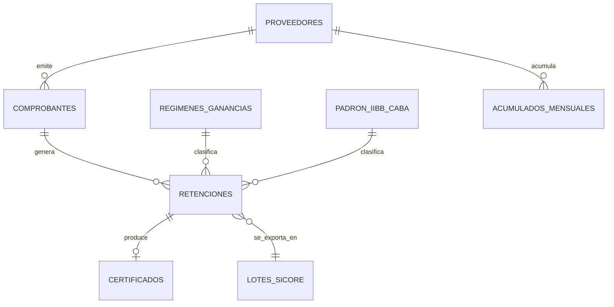
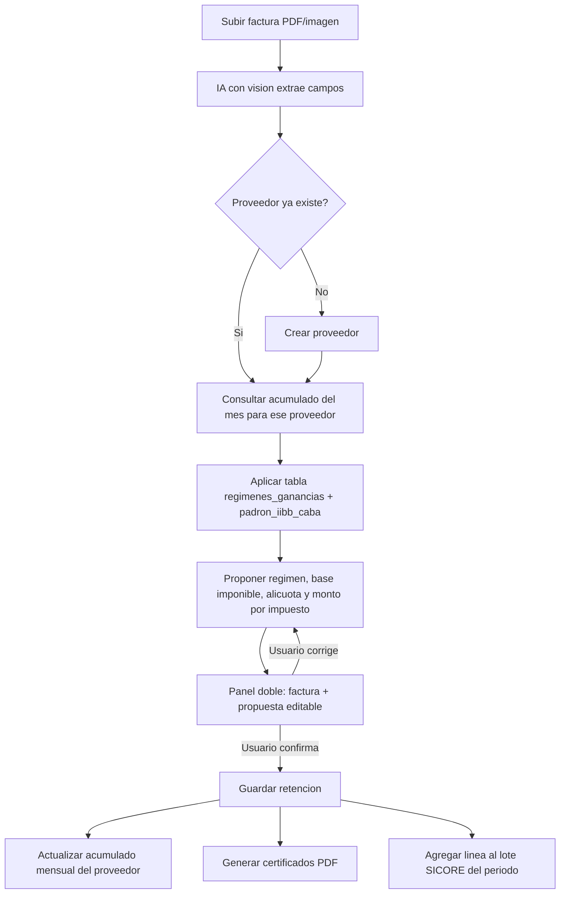

# Sistema de Retenciones — Diseño (Fiberhome Argentina)

> Documento vivo también disponible para edición colaborativa en:
> https://claude.ai/code/artifact/9c8a54ac-f4df-4d23-bb75-3c3173ab7096
>
> Fecha: 2026-09-17

## 1. Resumen

Fiberhome Argentina S.A. actúa como **agente de retención** de dos impuestos cada vez que le paga una factura a un proveedor: Impuesto a las Ganancias (nacional, vía SICORE/ARCA) e Ingresos Brutos de CABA (vía AGIP). Hoy este proceso es manual: alguien mira la factura, decide a mano qué régimen y alícuota corresponden, calcula la base imponible restando lo que ya se retuvo ese mes a ese proveedor, carga todo en dos planillas Excel paralelas, y genera a mano los certificados PDF y el archivo de texto para importar a SICORE.

El objetivo de este sistema es automatizar ese circuito de punta a punta, sin perder el control humano sobre el resultado final: se sube la factura, el sistema propone la clasificación y el cálculo, una persona lo revisa y confirma, y recién ahí se generan certificados y registros oficiales.

## 2. Alcance de la primera versión

Decisiones ya tomadas para esta etapa:

| Decisión | Elegido |
| --- | --- |
| Forma de uso | App web accesible por el equipo (no una herramienta local de un solo usuario) |
| Extracción de datos de la factura | IA con visión (no OCR tradicional + reglas) |
| Impuestos cubiertos | Ganancias (SICORE) + IIBB CABA (AGIP) — igual que hoy |
| Datos históricos | Se migra el histórico 2026 completo de ambos Excel a la base de datos nueva |

Queda fuera de esta primera versión (posible etapa futura, ya contemplada en el modelo de datos para no tener que rehacerlo después):

- Otras jurisdicciones de Ingresos Brutos (Buenos Aires y demás provincias — hay una hoja "BS AS" vacía en el Excel actual que sugiere que ya estaba prevista).
- Retención de IVA (columna "Ret. IVA (Reg.966)" que existe en el Excel actual pero aparece siempre vacía).
- Integración automática con AFIP para presentar el SICORE (se sigue generando el archivo de texto para importar manualmente, como hoy).

## 3. Modelo de datos



**proveedores** — CUIT (clave), razón social, domicilio, condición frente al IVA, tipo de persona (humana/jurídica, dato que necesita la tabla de Ganancias).

**comprobantes** — la factura subida: proveedor, fecha, tipo (A/B/C), punto de venta + número, concepto/descripción textual, monto neto, archivo original, estado (`pendiente` → `revisado` → `confirmado`).

**regimenes_ganancias** — tabla espejo del endpoint oficial de AFIP (ver sección 5): código de régimen, concepto, situación (inscripto/no inscripto), tipo de persona, alícuota, monto no sujeto a retención, monto mínimo de retención, fecha de la última sincronización.

**padron_iibb_caba** — CUIT, alícuota vigente, período de vigencia, tomado del padrón mensual de AGIP.

**acumulados_mensuales** — proveedor + impuesto (Ganancias/IIBB) + período (AAAA-MM) → base y monto ya retenidos ese mes. Es la tabla que el motor consulta ANTES de calcular una retención nueva, para saber si el mínimo no imponible ya se consumió (así se explica la Base Imponible negativa que aparece en el Excel actual).

**retenciones** — una fila por comprobante y por impuesto: régimen aplicado, base imponible, alícuota, monto retenido, fecha, número de certificado, quién confirmó.

**certificados** — los PDF generados (mismo layout que los actuales), enlazados 1 a 1 con cada retención.

**lotes_sicore** — agrupa las retenciones de Ganancias de un período para producir el archivo de texto de importación a SICORE.

## 4. Flujo end-to-end



Punto clave del paso E→F: el motor NO mira solo la factura actual. Para Ganancias, antes de aplicar el mínimo no imponible del régimen, resta lo que ese proveedor ya consumió ese mes (tabla `acumulados_mensuales`). Si ya superó el mínimo, la base imponible completa queda sujeta a retención desde el primer peso de la factura nueva — exactamente el comportamiento que se ve en las bases imponibles negativas del Excel actual.

Para IIBB CABA no hay mínimo acumulado: la alícuota sale directo del padrón AGIP vigente para ese CUIT ese mes.

## 5. Fuentes normativas verificadas

### Tabla de regímenes de Ganancias (RG 830)

El simulador oficial de AFIP (el mismo que usa la página pública en https://servicioscf.afip.gob.ar/calc-rg830/) expone por detrás un endpoint JSON que devuelve la tabla completa vigente:

```
POST https://servicioscf.afip.gob.ar/calc-rg830/default.aspx/conceptosalcliente
Content-Type: application/json; charset=UTF-8
Body: {}
```

Devuelve 75 combinaciones (régimen × situación inscripto/no inscripto × tipo de persona), cada una con `COD_REGIMEN`, concepto, `PORCENT_A_RETENER`, `MONTO_NO_SUJETO` (mínimo no imponible) y `MONTO_MINIMO` ($240, piso para no retener). La tabla completa está volcada en [`regimenes_ganancias_afip.json`](./regimenes_ganancias_afip.json) en esta misma carpeta, descargada el 2026-09-17.

**Verificación contra datos reales de Fiberhome:** para `COD_REGIMEN=94` (Locaciones de Obra y/o Servicios), inscripto, la tabla da alícuota 2% y mínimo no imponible $67.170. En `Retenciones_Ganancias_Practicadas_2026.xlsx`, la fila de ALONSO MIGUEL ANGEL tiene Monto Neto $1.794.000 y Base Imponible $1.726.830 → 1.794.000 − 67.170 = 1.726.830, exacto. El código 78 ("Enajenación de bienes muebles y bienes de cambio") que aparece en la hoja `FC C` también coincide con el mismo código en la tabla de AFIP. Es la misma codificación que Fiberhome ya usa hoy.

Hay también un segundo endpoint, `CalcularRetencion` (mismo host, `default.aspx/CalcularRetencion`), que hace el cálculo completo si se le manda situación, tipo de persona, monto, concepto, meses y pagos/retenciones anteriores del mes — candidato a reemplazar la lógica de cálculo propia para Ganancias.

**Riesgo:** es una API interna de AFIP, no un contrato público documentado. Puede cambiar de forma o dejar de responder sin aviso. Diseño propuesto: sincronizar y cachear esta tabla en `regimenes_ganancias` con un job periódico (por ejemplo diario), guardar la fecha de última sincronización exitosa, y si el endpoint falla seguir operando con la última tabla conocida mientras se alerta para revisión manual.

### Padrón de alícuotas IIBB CABA (AGIP)

AGIP publica el "Padrón de Regímenes Generales" todos los meses en una página pública, sin login ni clave fiscal:
https://www.agip.gob.ar/agentes/agentes-de-recaudacion/ib-agentes-recaudacion/padrones/Padr%C3%B3n-de-Reg%C3%ADmenes-Generales
con historial disponible desde 2016. Se probó la descarga directa del padrón de agosto 2026 (archivo `.rar` de ~20 MB) y funcionó sin autenticación.

**Limitación:** la URL exacta del archivo cambia de carpeta cada tanto (no sigue siempre el mismo patrón), así que la automatización tiene que *scrapear* la página índice una vez al mes, tomar el link del último período publicado, descargarlo y desempaquetarlo (formato RAR, no ZIP — hay que sumar esa dependencia al proyecto). El contenido del padrón coincide en estructura con las cadenas separadas por `;` que ya aparecen en la hoja `CABA` del Excel actual.

## 6. Pantallas

**Panel doble de revisión** (pantalla principal): factura a la izquierda (visor de PDF/imagen con zoom), propuesta editable a la derecha — datos extraídos (CUIT, razón social, fecha, número, concepto, monto) y debajo el cálculo propuesto para Ganancias e IIBB (régimen, base imponible, alícuota, monto a retener), cada campo editable. Se resalta en amarillo cualquier campo que el sistema no pudo inferir con confianza (proveedor nuevo, concepto ambiguo). Botón "Confirmar" solo se habilita cuando no quedan campos obligatorios vacíos.

**Bandeja de comprobantes** — lista de facturas por estado (pendiente / revisado / confirmado), con búsqueda por proveedor, CUIT o período.

**Ficha de proveedor** — histórico de retenciones y acumulado del mes en curso para ese CUIT, para auditar rápido "cuánto le retuvimos ya este mes".

**Cierre de período** — genera y descarga el lote SICORE del mes, con el listado de retenciones incluidas.

**Administración de tablas normativas** — muestra la última sincronización de `regimenes_ganancias` y `padron_iibb_caba`, permite forzar una sincronización manual y editar un valor a mano si hace falta un ajuste puntual.

## 7. Stack técnico y despliegue (propuesta, a confirmar)

| Capa | Propuesta | Motivo |
| --- | --- | --- |
| Backend | Python (FastAPI) | Mismo lenguaje que ya usamos para explorar los Excel; buenas librerías para generar PDF y parsear archivos de ancho fijo |
| Base de datos | PostgreSQL | Multiusuario, soporta bien las consultas de acumulados por proveedor/mes/impuesto |
| Frontend | Aplicación web (React o similar) | Necesario para el panel doble y que varias personas lo usen desde el navegador |
| Extracción de facturas | API de un modelo con visión (Claude) | Ya validado como enfoque en la decisión de alcance |
| Generación de PDF | Reproduce el layout exacto de los certificados actuales (SICORE y AGIP) | Para que no cambie nada de cara a AFIP/AGIP ni a los proveedores |
| Hosting | A definir: ¿servidor/nube propia de Fiberhome, o arrancamos con algo simple tipo un VPS o un servicio administrado? | Depende de infraestructura existente |

Esta capa es la que menos cerrada está todavía.

## 8. Riesgos, supuestos y preguntas abiertas

- [ ] **Hosting**: ¿dónde se despliega la app web? ¿hay infraestructura de Fiberhome ya elegida, o lo definimos desde cero?
- [ ] **Validación legal/contable**: antes de usar la tabla de regimenes_ganancias en producción, que el contador revise al menos los regímenes que más se usan (94, 31, 78 y los que aparezcan en "FC C") contra el endpoint de AFIP.
- [ ] **Usuarios y permisos**: ¿cuántas personas van a usar el sistema y necesitan distinguirse roles (por ejemplo, quién puede confirmar una retención vs. quién solo carga facturas)?
- [ ] **Migración del histórico**: los dos Excel actuales no siempre tienen la misma estructura fila a fila (hay filas en blanco, celdas fusionadas, un renglón de subtotal "1Q" en la hoja principal) — la migración va a necesitar limpieza manual asistida, no un import automático ciego.
- **Riesgo técnico principal**: los dos endpoints de AFIP y la página de descarga de AGIP no son APIs públicas contratadas — son las mismas que usan sus sitios web públicos, pero pueden cambiar sin aviso. El diseño los trata como fuente externa cacheada, nunca como dependencia en tiempo real crítica.
